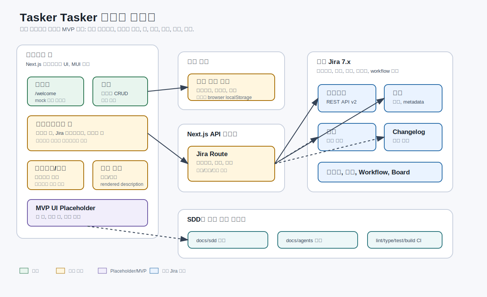

# 현재 구현 현황

이 문서는 Tasker Tasker를 이어서 개발할 사람이 현재 앱에서 실제로 동작하는 기능, 아직 placeholder인 기능, 그리고 확정된 MVP 범위를 빠르게 확인할 수 있도록 정리한 문서입니다.

## 제품 방향

Tasker Tasker는 Jira 7.x 계열 환경을 우선 지원하는 로컬 우선 작업 관리 워크스페이스입니다. 확정된 MVP는 read-only가 아닙니다. Jira 이슈 조회뿐 아니라 생성, 편집, 팀 뷰, 칸반 뷰, 이슈 검색까지 포함합니다.

크레덴셜은 사용자의 로컬 머신에만 저장합니다. 현재 웹 앱에서는 브라우저 `localStorage`를 사용합니다. 이후 Tauri 앱에서는 OS 기반 로컬 보안 저장소로 옮기는 것이 목표입니다.

## 도메인 구성도

구성도 설명은 `docs/domain-map.md`에 따로 정리되어 있습니다.

## 상태 표기

- 완료: 현재 앱에서 사용할 수 있음
- 부분 구현: 코드와 화면은 있으나 동작이 불완전함
- Placeholder: 메뉴나 화면만 있고 실제 기능은 없음
- MVP 예정: MVP 범위로 확정됐지만 아직 구현되지 않음

## 현재 구현된 기능

| 영역 | 상태 | 현재 동작 |
| --- | --- | --- |
| 앱 셸 | 완료 | 루트 워크스페이스, 상단 플랫폼 탭, 왼쪽 Jira 내비게이션, 콘텐츠 탭, 닫을 수 있는 상세 탭, 설정 FAB가 있음. |
| 최초 실행 라우팅 | 완료 | 등록된 플랫폼이 없으면 루트 페이지에서 `/welcome`으로 이동함. |
| 플랫폼 온보딩 | 부분 구현 | `/welcome`에서 플랫폼 타입, Jira URL, 사용자명, 토큰을 입력받음. 연결 테스트는 아직 mock임. |
| 플랫폼 관리 | 완료 | `/settings`에서 로컬 플랫폼 정보를 추가, 수정, 삭제할 수 있음. |
| 로컬 크레덴셜 저장 | 부분 구현 | Jira URL과 크레덴셜이 `tasker-platforms` 키로 브라우저 `localStorage`에 저장됨. 로컬 저장 조건은 만족하지만 보안 저장소는 아님. |
| 테마 설정 | 완료 | 테마 모드와 커스텀 색상이 로컬에 저장되고 MUI 테마로 적용됨. |
| Jira 프로젝트 API | 완료 | `GET /api/jira/projects`가 Jira `GET /rest/api/2/project`를 프록시함. |
| Jira 이슈 목록 API | 완료 | `GET /api/jira/issues?projectKey=...`가 특정 프로젝트의 Jira search를 프록시함. |
| Jira 이슈 상세 API | 부분 구현 | `GET /api/jira/issue/{issueKey}`가 rendered fields와 changelog를 가져옴. Jira 댓글을 별도 원천으로 가져오지는 않음. |
| Jira 프로젝트/이슈 UI | 부분 구현 | 프로젝트 목록과 이슈 테이블이 있음. 이슈 행 표시와 empty/error 상태는 정리가 필요함. |
| Jira 이슈 상세 UI | 부분 구현 | 키, 요약, 상태, rendered description을 보여줌. 댓글은 changelog에서 comment 항목을 찾는 방식이라 MVP 요구와 다름. |
| 자동 검증 | 완료 | `npm run verify`가 lint, typecheck, Vitest, Next build를 실행함. |
| CI | 완료 | GitHub Actions가 install, lint, typecheck, test, build를 실행함. |

## MVP지만 아직 구현되지 않은 기능

| 영역 | 상태 | MVP 요구사항 |
| --- | --- | --- |
| 실제 연결 테스트 | MVP 예정 | 온보딩에서 Jira 서버와 인증 정보를 실제로 검증해야 함. |
| 이슈 생성 | MVP 예정 | Jira metadata와 validation error를 반영해 이슈를 생성할 수 있어야 함. |
| 이슈 편집 | MVP 예정 | 권한과 workflow 제약을 보여주면서 지원 필드를 편집할 수 있어야 함. |
| 팀 뷰 | Placeholder | 화면은 있지만 텍스트만 있음. MVP에서는 Jira 팀/역할/사용자 데이터를 보여줘야 함. |
| 칸반 뷰 | Placeholder | 화면은 있지만 텍스트만 있음. MVP에서는 상태나 보드 컬럼 기준으로 이슈를 보여주고 가능한 전환을 지원해야 함. |
| 이슈 검색 | Placeholder | 화면은 있지만 텍스트만 있음. MVP에서는 선택된 Jira 플랫폼 전체에서 이슈를 검색/필터링해야 함. |
| 원천별 댓글/활동 표시 | MVP 예정 | Jira 댓글, changelog 활동, 향후 다른 플랫폼 댓글을 원천별로 라벨링해야 함. |
| 보안 로컬 크레덴셜 저장 | MVP/Tauri 예정 | 웹 MVP는 브라우저 로컬 저장소를 사용하고, Tauri에서는 OS 기반 로컬 보안 저장소로 옮겨야 함. |

## 현재 로컬 저장 키

| 키 | 용도 |
| --- | --- |
| `tasker-platforms` | Jira URL과 크레덴셜을 포함한 플랫폼 정보 |
| `themeMode` | 라이트, 다크, 시스템 테마 모드 |
| `customPrimaryColor`, `customSecondaryColor`, `customPositiveColor`, `customImportantColor`, `customErrorColor` | 사용자 지정 테마 색상 |
| `lastSelectedProject` | 마지막으로 선택한 Jira 프로젝트 키. 이후 플랫폼별로 분리하는 것이 좋음. |

## 현재 API 표면

| Route | Jira 호출 | 현재 모드 |
| --- | --- | --- |
| `GET /api/jira/projects` | `GET /rest/api/2/project` | 조회 |
| `GET /api/jira/issues?projectKey=KEY` | `GET /rest/api/2/search?jql=project=KEY` | 조회 |
| `GET /api/jira/issue/{issueKey}` | `GET /rest/api/2/issue/{issueKey}?expand=renderedFields,changelog` | 조회 |

MVP API 작업에서는 이슈 생성, 이슈 편집, 댓글, metadata discovery, 검색, 팀 데이터, 칸반/status transition을 추가해야 합니다.

## 알려진 리스크

- 브라우저 `localStorage`는 로컬 저장이지만 암호화된 저장소는 아닙니다.
- 온보딩 연결 테스트가 mock입니다.
- 이슈 상세에서 Jira HTML을 렌더링하므로 sanitization 또는 명시적인 신뢰 정책이 필요합니다.
- 댓글이 아직 원천별로 분리되지 않습니다.
- 이슈 생성/편집 흐름이 없습니다.
- 현재 API route는 클라이언트가 전달한 Jira URL과 인증 헤더를 신뢰합니다.
- 팀, 칸반, 검색은 내비게이션에 있지만 실제 구현은 placeholder입니다.

